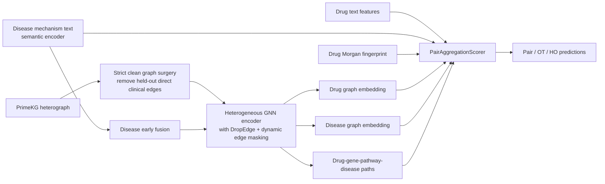
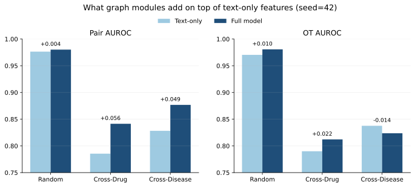

# Zero-Shot Drug Repurposing via Dual-Tower Semantics and Topological Gating

This repository contains a research codebase for **zero-shot drug repurposing** with **multi-modal biomedical knowledge graphs**. The current public branch reflects the latest **v2 evaluation protocol**, where dataset splits are regenerated from raw PrimeKG target edges and graph leakage is explicitly audited before training.

The benchmark is built around three evaluation regimes:
- **internal pairwise prediction** on `random`, `cross_drug`, and `cross_disease`
- **external Open Targets (OT)** generalization
- **held-out high-order mechanism ranking**

## Highlights

- **Regenerated v2 splits** rebuild `random`, `cross_drug`, and `cross_disease` directly from raw PrimeKG clinical target edges.
- **Strict graph cleaning** removes held-out direct clinical edges from the message-passing graph for `valid`, `test`, and `ot`.
- **Dynamic edge masking** prevents train-time target leakage by dropping the current batch's positive clinical edges before GNN encoding.
- **Split-aware negative sampling** prevents cold-start drugs and diseases from being used as training negatives in the wrong split.
- **Mechanism-aware evaluation** reports pairwise metrics, OT generalization, and high-order mechanism ranking together.

## Method Overview

The main modeling line combines:
- **Disease-side semantic prior (early fusion):** disease mechanism text is encoded and injected into disease nodes before GNN message passing.
- **Drug-side chemistry anchor (late fusion):** Morgan fingerprints are fused only at the scorer stage.
- **Dual-tower semantic alignment:** drug and disease text features can be compared in a shared biomedical semantic space.
- **Micro-path mechanism features:** drug-gene-pathway-disease paths are pooled and scored as additional topological evidence.
- **Leakage-controlled graph training:** the clinical answer edges are hidden from message passing while mechanism edges remain visible.



## Protocol Guardrails

The latest branch includes the engineering fixes that made the benchmark peer-review ready:
- `src/generate_splits.py` regenerates split assets from raw PrimeKG clinical target edges.
- `remove_direct_leakage_edges(...)` is applied to `valid`, `test`, and `ot` holdout pairs when constructing the message-passing graph.
- training uses **batch-level dynamic masking**, so the current positive edge is not visible to the GNN during its own forward pass.
- training negatives are **split-aware**, which prevents held-out diseases or drugs from being mislabeled as negatives during cold-start training.

## Visual Summary





Figure generation script:
- `python scripts/generate_readme_figures.py`

## Latest Results

### Full model under the latest v2 protocol (3 seeds)

| Split | Pair AUROC | OT AUROC | HO AUPRC |
|---|---:|---:|---:|
| `random` | `0.9790 +/- 0.0046` | `0.9815 +/- 0.0037` | `0.3284 +/- 0.0042` |
| `cross_drug` | `0.8319 +/- 0.0071` | `0.8217 +/- 0.0072` | `0.3081 +/- 0.0074` |
| `cross_disease` | `0.8789 +/- 0.0078` | `0.8446 +/- 0.0184` | `0.3274 +/- 0.0093` |

### Text-only baseline vs full model (`seed=42`)

| Split | Text-only Pair AUROC | Full Pair AUROC | Gain |
|---|---:|---:|---:|
| `random` | `0.9764` | `0.9802` | `+0.0038` |
| `cross_drug` | `0.7855` | `0.8414` | `+0.0559` |
| `cross_disease` | `0.8282` | `0.8768` | `+0.0486` |

### Cross-disease ablation snapshot (`seed=42`)

| Variant | Pair AUROC | OT AUROC | HO AUPRC |
|---|---:|---:|---:|
| `Text-only` | `0.8282` | `0.8376` | `0.3149` |
| `w/o Text Semantics` | `0.8648` | `0.8475` | `0.3110` |
| `w/o Micro-Path` | `0.8791` | `0.8534` | `0.3215` |
| `Full` | `0.8768` | `0.8237` | `0.3240` |
| `w/o Gated Fusion` | `0.8989` | `0.8870` | `0.3204` |

Notes:
- multi-seed numbers are used for the main protocol summary.
- the ablation table is a **single-seed diagnostic snapshot** and is reported as-is.
- under the current implementation, text semantics is the most stable contributor, while gated fusion remains an open design knob rather than a settled source of gain.

## Repository Layout

- `src/`: model, graph surgery, samplers, split generation, and training utilities
- `scripts/`: training, evaluation, audits, feature extraction, and figure generation
- `tests/`: regression tests for core logic
- `assets/readme/`: README figures and compact summary metrics used for public presentation

## Data Preparation

This repository is intentionally **code-first**. Large datasets, local model weights, checkpoints, and intermediate embeddings are not tracked in Git.

### Required local assets

| Asset | Purpose | Expected Local Path | How it is produced |
|---|---|---|---|
| PrimeKG node / edge tables | metadata lookup | `data/PrimeKG/nodes.csv`, `data/PrimeKG/edges.csv` | local data preparation |
| v2 split assets | pair splits for training/evaluation | `data/PrimeKG/processed/primekg_indication_*_v2.pt` | `python src/generate_splits.py --output-dir data/PrimeKG/processed --overwrite` |
| Disease SapBERT embeddings | disease text tower / early fusion | `thick_disease_text_embeddings_sapbert.pkl` | `python scripts/generate_sapbert_embeddings.py` |
| Drug SapBERT embeddings | drug text tower | `thick_drug_text_embeddings_sapbert.pkl` | `python scripts/generate_drug_sapbert_embeddings.py` |
| Drug Morgan fingerprints | chemistry branch | `drug_morgan_fingerprints.pkl` | `python scripts/extract_morgan.py` |
| Triplet text embeddings | weak teacher distillation | `triplet_text_embeddings.pkl` | `python scripts/extract_triplet_embs.py` |
| Graph node feature directory | precomputed node features injected into PrimeKG | `outputs/pubmedbert_hybrid_features/` | local feature preprocessing |
| Local model weights | SapBERT / PubMedBERT cache | `models/` | user-managed local download |

### Data not included in Git

Examples of excluded assets:
- PrimeKG raw and processed graph files
- Open Targets export files
- local SapBERT / PubMedBERT checkpoints
- experiment logs and frozen training snapshots
- derived `.pkl`, `.pt`, `.pth`, `.db`, `.sqlite`, and large output artifacts

Before redistributing any data or derived artifacts, verify the license terms of the upstream sources you used to build them.

## Quick Start

### 1. Install dependencies

```bash
pip install -r requirements.txt
```

### 2. Regenerate the v2 split assets

```bash
python src/generate_splits.py --output-dir data/PrimeKG/processed --overwrite
```

### 3. Generate semantic features

```bash
python scripts/generate_sapbert_embeddings.py --prefer-local-model
python scripts/generate_drug_sapbert_embeddings.py --prefer-local-model
python scripts/extract_morgan.py
python scripts/extract_triplet_embs.py
```

### 4. Train one leakage-controlled run

Example: `cross_disease` on the latest `v2` protocol.

```bash
python scripts/train_quad_split_ho_probe.py \
  --processed-path data/PrimeKG/processed/primekg_indication_cross_disease_v2.pt \
  --output-json outputs/example_cross_disease_v2.json \
  --checkpoint-path outputs/example_cross_disease_v2.pt \
  --nodes-csv data/PrimeKG/nodes.csv \
  --edges-csv data/PrimeKG/edges.csv \
  --feature-dir outputs/pubmedbert_hybrid_features \
  --drug-morgan-fingerprints-path drug_morgan_fingerprints.pkl \
  --drug-text-embeddings-path thick_drug_text_embeddings_sapbert.pkl \
  --disease-text-embeddings-path thick_disease_text_embeddings_sapbert.pkl \
  --graph-surgery-mode strict \
  --dropedge-p 0.15 \
  --epochs 60 \
  --eval-every 10 \
  --seed 42
```

### 5. Evaluate pair-fixed HO

```bash
python scripts/eval_pair_fixed_ho.py \
  --checkpoint-path outputs/example_cross_disease_v2.pt \
  --processed-path data/PrimeKG/processed/primekg_indication_cross_disease_v2.pt \
  --nodes-csv data/PrimeKG/nodes.csv \
  --edges-csv data/PrimeKG/edges.csv \
  --feature-dir outputs/pubmedbert_hybrid_features \
  --graph-surgery-mode strict \
  --output-json outputs/example_cross_disease_v2_pairfixed_ho.json
```

### 6. Regenerate README figures

```bash
python scripts/generate_readme_figures.py
```

## Engineering Scope

This repository is organized as a research engineering codebase rather than a general-purpose library. The main implementation scope includes:
- graph-data cleaning and leakage audits
- split regeneration and protocol validation
- multimodal feature routing under OOD constraints
- mechanism-aware evaluation beyond plain AUROC
- experiment orchestration, ablations, and regression tests

## Citation

If you use this repository, please cite it as:

```bibtex
@misc{zero_shot_drug_repurposing_dual_tower_2026,
  title        = {Zero-Shot Drug Repurposing via Dual-Tower Semantics and Topological Gating},
  year         = {2026},
  howpublished = {\url{https://github.com/Yanagisawa2002/Zero-Shot-Drug-Repurposing-via-Dual-Tower-Semantics-and-Topological-Gating}}
}
```

## License

The code in this repository is released under the MIT License. See [LICENSE](LICENSE).
