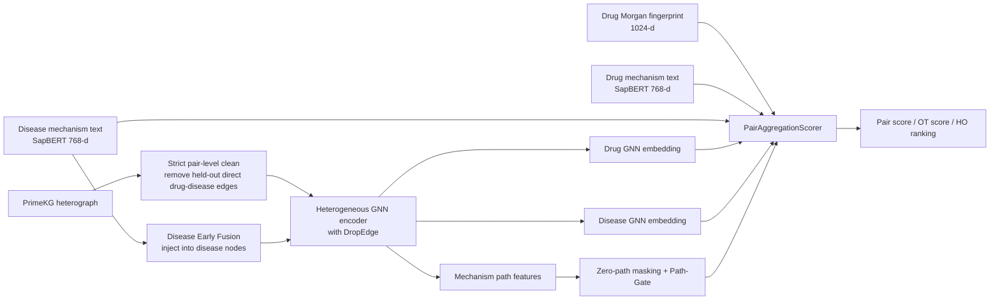
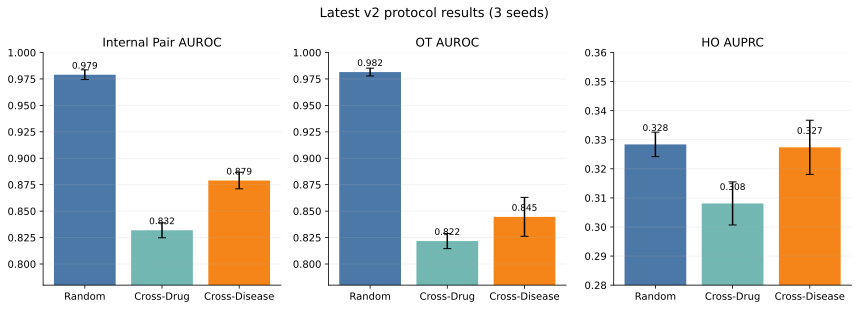
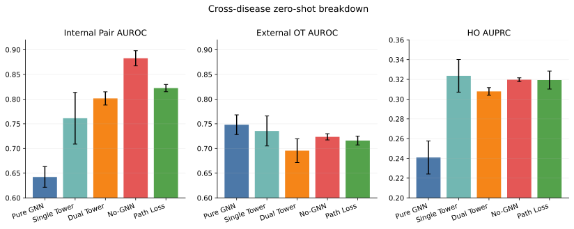

# Zero-Shot Drug Repurposing via Dual-Tower Semantics and Topological Gating

This repository contains a research codebase for **zero-shot drug repurposing** with **multi-modal biomedical knowledge graphs**. The main goal is to predict drug-disease associations under strict out-of-distribution settings, especially **cross-disease** generalization, while also evaluating **mechanism-level** ranking quality.

The public code focuses on three evaluation regimes:
- internal pairwise prediction
- external Open Targets generalization
- held-out high-order mechanism ranking

## Highlights

- **Strict pair-level clean protocol** removes direct held-out drug-disease shortcut edges before training.
- **Asymmetric routing** injects disease semantics into the graph encoder while keeping drug chemistry as a late fusion anchor.
- **Dual-tower SapBERT features** allow the scorer to compare drug-side and disease-side mechanism text in the same semantic space.
- **Path-gate** explicitly silences empty-path pairs, which is critical after strict cleaning.
- **Mechanism-aware evaluation** includes both conventional HO ranking and pair-fixed HO diagnostics.

## Method Overview

The main modeling line combines:
- **Disease-side semantic prior (Early Fusion):** disease mechanism text is encoded with SapBERT and injected into disease nodes before GNN message passing.
- **Drug-side chemistry anchor (Late Fusion):** Morgan fingerprints are fused only at the scorer stage to preserve sharp chemical discrimination.
- **Dual-tower semantic alignment:** SapBERT drug text and SapBERT disease text can be fused symmetrically at the scoring head.
- **Topological gating:** path-level aggregation uses zero-path masking and adaptive gating so empty mechanism sets do not inject noise.
- **Strict pair-level clean graph surgery:** held-out drug-disease shortcut edges are removed before training.



## Why The README Ablations Matter

One easy point of confusion is that under **strict pair-level clean**, the `No-GNN` ablation can outperform the dual-tower graph model on **cross-disease Pair AUROC / OT AUROC**. That does **not** mean the graph is useless.

The correct interpretation is:
- disease semantics are the dominant source of **zero-shot disease generalization**
- graph topology contributes **mechanism-level discrimination**, not necessarily the best pairwise AUROC in the hardest cold-start setting
- pair-fixed HO metrics are needed to reveal whether the model is actually distinguishing internal mechanism paths or merely exploiting pair-level semantics

So the graph encoder in this project should be read as a **mechanism-sensitive topological prior**, not as the sole driver of all headline metrics.

## Visual Summary

The figures below are generated from multi-seed experiment summaries under the strict pair-level clean protocol.





Figure generation script:
- `python scripts/generate_readme_figures.py`

## Selected Results

### Dual-tower main line across the three splits

| Split | Pair AUROC | OT AUROC | HO AUPRC |
|---|---:|---:|---:|
| `random` | `0.9873 +/- 0.0018` | `0.8500 +/- 0.0109` | `0.3323 +/- 0.0054` |
| `cross_drug` | `0.8854 +/- 0.0202` | `0.8122 +/- 0.0161` | `0.3194 +/- 0.0072` |
| `cross_disease` | `0.8014 +/- 0.0134` | `0.6956 +/- 0.0240` | `0.3078 +/- 0.0039` |

### Cross-disease ablation snapshot

| Variant | Pair AUROC | OT AUROC | HO AUPRC |
|---|---:|---:|---:|
| `Pure GNN` | `0.6423 +/- 0.0211` | `0.7482 +/- 0.0199` | `0.2409 +/- 0.0167` |
| `Single Tower` | `0.7613 +/- 0.0523` | `0.7355 +/- 0.0304` | `0.3236 +/- 0.0165` |
| `Dual Tower` | `0.8014 +/- 0.0134` | `0.6956 +/- 0.0240` | `0.3078 +/- 0.0039` |
| `No-GNN` | `0.8828 +/- 0.0154` | `0.7236 +/- 0.0063` | `0.3197 +/- 0.0019` |
| `Path Loss` | `0.8224 +/- 0.0074` | `0.7161 +/- 0.0089` | `0.3193 +/- 0.0091` |

## Repository Layout

- `src/`: model, graph surgery, samplers, and training utilities
- `scripts/`: training, evaluation, audits, feature extraction, and figure generation
- `tests/`: regression tests for core logic
- `assets/readme/`: README figures and compact summary metrics used for public presentation

## Data Preparation

This repository is intentionally **code-first**. Large datasets, local model weights, checkpoints, and intermediate embeddings are not tracked in Git.

### Required local assets

| Asset | Purpose | Expected Local Path | How it is produced |
|---|---|---|---|
| PrimeKG processed graph | core heterograph for training | `data/PrimeKG/processed/primekg_indication_*.pt` | local preprocessing |
| PrimeKG node / edge tables | metadata lookup | `data/PrimeKG/nodes.csv`, `data/PrimeKG/edges.csv` | local data preparation |
| Disease mechanism texts | disease SapBERT input | `data/disease_mechanism_texts.json` | external / local generation |
| Drug mechanism texts | drug SapBERT input | `data/drug_mechanism_texts.json` | external / local generation |
| Disease SapBERT embeddings | disease text tower / early fusion | `thick_disease_text_embeddings_sapbert.pkl` | `python scripts/generate_sapbert_embeddings.py` |
| Drug SapBERT embeddings | drug text tower | `thick_drug_text_embeddings_sapbert.pkl` | `python scripts/generate_drug_sapbert_embeddings.py` |
| Drug Morgan fingerprints | chemistry branch | `drug_morgan_fingerprints.pkl` | `python scripts/extract_morgan.py` |
| Triplet text embeddings | weak teacher distillation | `triplet_text_embeddings.pkl` | `python scripts/extract_triplet_embs.py` |
| Local model weights | SapBERT / PubMedBERT cache | `models/` | user-managed local download |

### Data not included in Git

Examples of excluded assets:
- PrimeKG raw and processed graph files
- Open Targets export files
- local SapBERT / PubMedBERT checkpoints
- experiment logs and frozen training snapshots
- derived `.pkl`, `.pt`, `.pth`, `.db`, `.sqlite`, and large output artifacts

Before redistributing any data or derived artifacts, verify the license terms of the upstream sources you used to build them.

## Quick Start

### 1. Install dependencies

```bash
pip install -r requirements.txt
```

### 2. Generate SapBERT features

```bash
python scripts/generate_sapbert_embeddings.py --prefer-local-model
python scripts/generate_drug_sapbert_embeddings.py --prefer-local-model
```

### 3. Train one strict-clean run

Example: `random` split with dual-tower semantics and path-gate.

```bash
python scripts/train_quad_split_ho_probe.py ^
  --processed-path data/PrimeKG/processed/primekg_indication_mvp.pt ^
  --output-json outputs/example_random_dualtower.json ^
  --checkpoint-path outputs/example_random_dualtower.pt ^
  --nodes-csv data/PrimeKG/nodes.csv ^
  --edges-csv data/PrimeKG/edges.csv ^
  --feature-dir outputs/pubmedbert_hybrid_features_clean ^
  --triplet-text-embeddings-path triplet_text_embeddings.pkl ^
  --drug-morgan-fingerprints-path drug_morgan_fingerprints.pkl ^
  --drug-text-embeddings-path thick_drug_text_embeddings_sapbert.pkl ^
  --disease-text-embeddings-path thick_disease_text_embeddings_sapbert.pkl ^
  --use-early-external-fusion ^
  --graph-surgery-mode strict ^
  --primary-loss-type bce ^
  --text-distill-alpha 0.2 ^
  --dropedge-p 0.15 ^
  --epochs 60 ^
  --seed 42
```

### 4. Evaluate pair-fixed HO

```bash
python scripts/eval_pair_fixed_ho.py ^
  --checkpoint-path outputs/example_random_dualtower.pt ^
  --processed-path data/PrimeKG/processed/primekg_indication_mvp.pt ^
  --nodes-csv data/PrimeKG/nodes.csv ^
  --edges-csv data/PrimeKG/edges.csv ^
  --feature-dir outputs/pubmedbert_hybrid_features_clean ^
  --graph-surgery-mode strict ^
  --output-json outputs/example_random_dualtower_pairfixed_ho.json
```

### 5. Regenerate README figures

```bash
python scripts/generate_readme_figures.py
```

## Why This Repo Is Useful on a Resume

This project is structured as a research engineering codebase rather than a small tutorial package. The strongest engineering contributions are:
- graph-data cleaning and leakage prevention
- multimodal feature routing under OOD constraints
- mechanism-aware evaluation beyond plain AUROC
- large ablation orchestration with reproducibility-focused scripts and tests

## Citation

If you use this repository, please cite it as:

```bibtex
@misc{zero_shot_drug_repurposing_dual_tower_2026,
  title        = {Zero-Shot Drug Repurposing via Dual-Tower Semantics and Topological Gating},
  year         = {2026},
  howpublished = {\url{https://github.com/Yanagisawa2002/Zero-Shot-Drug-Repurposing-via-Dual-Tower-Semantics-and-Topological-Gating}}
}
```

## License

The code in this repository is released under the MIT License. See [LICENSE](LICENSE).
